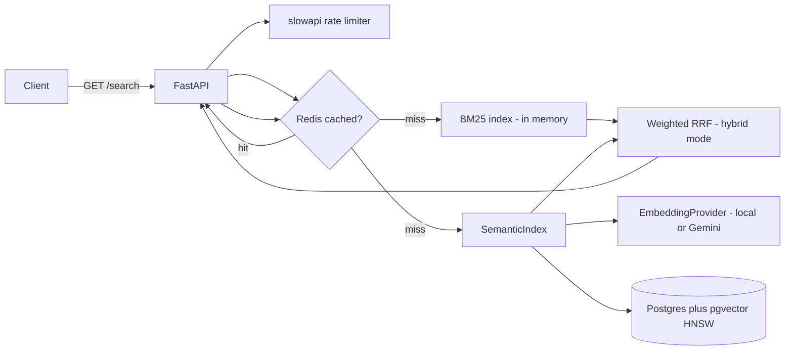

# Semantic Search-as-a-Service

Finds documents by meaning, not keywords — built and measured in phases
against a real 63,636-chunk corpus (FiQA-2018, a StackExchange finance
dump), not a toy dataset. Every phase ends in a number, not just working
code.

```bash
curl "http://localhost:8000/search?q=how%20do%20I%20get%20my%20money%20back&k=3&mode=semantic"
```
returns the "Return & Refund Policy" doc — even though it never uses the
word "money." Keyword search alone ranks it far down or misses it
entirely; that's the whole point of this project.

## Architecture



- **Keyword** — BM25 over all chunks, in-memory (`rank_bm25`)
- **Semantic** — sentence-transformers embeddings, pgvector cosine similarity, HNSW-indexed
- **Hybrid** — weighted Reciprocal Rank Fusion of both

All three modes are live behind one endpoint (`mode=keyword|semantic|hybrid`);
the API defaults to `semantic`, since that's what the numbers below say is
actually best on this dataset.

## Results (Phase 2 — real, not illustrative)

Measured against FiQA's labeled test split (648 queries) on the full
63,636-chunk corpus:

| Method | recall@10 | precision@10 | MRR | nDCG@10 |
|---|---|---|---|---|
| keyword (BM25) | 0.2675 | 0.0594 | 0.2784 | 0.2138 |
| semantic (MiniLM + pgvector) | 0.4402 | 0.1052 | 0.4390 | 0.3630 |
| hybrid (weighted RRF) | 0.4264 | 0.1037 | 0.4160 | 0.3429 |

These line up closely with published BEIR benchmark numbers for FiQA (BM25
nDCG@10 ~0.21–0.24, small dense models ~0.36–0.40 in the literature) — an
independent signal the implementation is measuring something real, not an
artifact of this specific pipeline.

**Notable finding: hybrid doesn't beat semantic alone here.** Two
hypotheses were tested and ruled in/out with real re-measurements, not just
theory:
- *Zero-score BM25 hits diluting RRF* — tested by filtering them out. No
  measurable change: at this corpus scale, near-universal stopword overlap
  means true zero-overlap almost never happens (unlike on a small toy
  corpus, where it's common).
- *Unweighted RRF over-trusting a comparatively weak retriever* — tested
  with weighted RRF (BM25 weighted 0.5x vs semantic 1.0x). This closed
  roughly half the gap (recall@10 0.414 → 0.426, nDCG@10 0.330 → 0.343) but
  didn't fully close it.

Conclusion: on FiQA, semantic search alone is the strongest single mode.
That's why the API defaults to it rather than hybrid.

## Load test & SLA (Phase 4)

Locust, 50 concurrent users, 2-minute sustained mixed workload
(`locustfile.py`):

| Config | req/s | median latency |
|---|---|---|
| 1 worker, no connection pooling | 11.1 | 1,300ms |
| 4 workers + pooling, no thread capping | 8.2 | 1,400ms *(worse!)* |
| 4 workers + pooling + thread capping | **28.6** | **240ms** |

**Bottleneck found and fixed: CPU thread oversubscription.** Adding
`--workers 4` alone made things *worse* — each worker process independently
let PyTorch/BLAS grab most of the machine's cores for every embedding call,
so 4 processes fought each other for the same cores instead of getting real
parallelism. The fix (`OMP_NUM_THREADS=1` / `MKL_NUM_THREADS=1` /
`OPENBLAS_NUM_THREADS=1`, plus `torch.set_num_threads(1)` as a code-level
backstop) capped each worker to disciplined single-threaded compute, and
throughput more than doubled versus even the un-pooled single-worker
baseline.

**SLA:** cached queries p50 120ms / p95 620ms; uncached semantic queries
p50 650ms / p95 3.5s; hybrid mode p50 1.7s / p95 4.6s. Sustained ~29 req/s,
0% errors across 3,418 requests. (Full interactive charts:
`results/loadtest3.html`.)

## Key tradeoffs

- **pgvector over Qdrant** — one system (Postgres) for documents + vectors
  instead of two; simpler mental model to build against. Qdrant would be
  the pick if rich metadata filtering or a much bigger corpus were
  requirements.
- **Local embeddings over a hosted API** — free, offline, and the pluggable
  `EmbeddingProvider` interface (mirroring the provider-agnostic pattern
  from Argus Lite) makes swapping providers a config change, not a
  rewrite. Actually tried switching to Gemini (`gemini-embedding-001`,
  free tier) — its ~100 requests/minute limit made embedding a 63k-document
  corpus impractical (10+ hours, possibly days against a daily cap). Local
  stays the default; the Gemini path is real, tested code, just not the
  right fit at this corpus size on a free tier.
- **Weighted RRF over plain RRF** — see Results above; measured, not assumed.
- **Connection pooling + per-process thread caps** — both came directly out
  of load-test findings, not speculative hardening.

## Repo layout

```
semantic-search-service/
├── app/
│   ├── config.py, db.py, main.py, cache.py, logging_config.py
│   └── search/
│       ├── chunking.py, bm25_search.py, semantic_search.py
│       ├── embeddings.py, hybrid.py, ranking.py, hnsw_index.py
├── eval/metrics.py
├── scripts/
│   ├── download_fiqa.py, init_db.py, ingest.py, embed_chunks.py
│   ├── run_baseline_eval.py, run_phase2_eval.py
│   └── benchmark_hnsw.py
├── tests/            # 26 tests; only test_cache mocks an external service
├── locustfile.py
├── Dockerfile, docker-compose.yml
├── run.ps1, run.sh   # thread-capped local dev launch
└── requirements.txt
```

## Running it

```bash
# One-time setup
pip install -r requirements.txt
cp .env.example .env
python -m scripts.init_db
python scripts/download_fiqa.py
python -m scripts.ingest
python -m scripts.embed_chunks

# Run
./run.ps1                    # or run.sh — thread-capped, 4 workers
# or: docker compose up

# Verify
python -m pytest tests/ -v
curl "http://localhost:8000/search?q=how+do+I+get+my+money+back&k=3"
```

## Phase 6 — hand-built HNSW (optional deep dive)

`app/search/hnsw_index.py` implements HNSW from scratch (Malkov & Yashunin,
2016) — not to replace pgvector's index, but to prove out understanding of
how approximate nearest-neighbor search actually works. Benchmarked against
`hnswlib` and exact brute-force search (`scripts/benchmark_hnsw.py`) on
build time, recall@10 vs. brute-force ground truth, and query latency.

First pass (on a clustered synthetic set) used simple closest-M neighbor
selection and measured recall@10=0.82 against hnswlib's 0.998 — a real
gap, not noise. The cause: plain closest-M selection can pick several
near-duplicate neighbors all in the same direction, starving the graph of
long-range connectivity. Implementing the paper's actual diversity
heuristic (Algorithm 4 — keep a candidate only if it's closer to the query
than to every already-selected neighbor) fixed it, and the fix held up on
real data too:

| Index | build time | recall@10 | query p50 |
|---|---|---|---|
| hand-built HNSW | 81.8s | 1.0000 | 2.07ms |
| hnswlib | 0.2s | 0.9995 | 0.08ms |
| brute force (numpy) | 0s | 1.0000 (ground truth) | 1.23ms |

Real run: 5,000 of the full 63,636 chunks, real MiniLM embeddings (not
synthetic data) — `python -m scripts.benchmark_hnsw --n 5000 --queries 200`.

Two honest takeaways, not just "I built HNSW":
1. **The neighbor-selection heuristic isn't a minor detail — it's most of
   what makes HNSW work well on real (non-uniformly-distributed) data.**
   Skipping it cost 18 points of recall on synthetic data; on real
   embeddings, both hand-built and hnswlib land at ~99.95–100% recall —
   the heuristic is what makes a hand-rolled implementation competitive
   with a production library on *quality*, even though it's nowhere close
   on *speed*.
2. **A hand-rolled graph index in pure Python doesn't automatically beat
   brute force.** At 5,000 real vectors, brute force (one vectorized numpy
   matrix multiply) was still faster per-query (1.23ms) than the hand-built
   graph traversal (2.07ms) — Python-level overhead (heap operations, dict
   lookups, function calls per node visited) dominates until the corpus is
   large enough that O(log n) graph traversal actually wins over O(n)
   brute force. hnswlib is ~400x faster to build and ~25x faster per query
   than the hand-built version — because it's compiled, not because the
   algorithm is fundamentally different from what's implemented here.

### Running the Phase 6 benchmark

```bash
pip install -r requirements.txt   # adds hnswlib
python -m pytest tests/test_hnsw_index.py -v   # correctness vs brute-force ground truth
python -m scripts.benchmark_hnsw --n 5000 --queries 200
```
Run above at `--n 5000` on the real corpus (results in the table above).
Pushing `--n` toward the full 63,636 chunks would pin down exactly where
(if anywhere, for a pure-Python implementation) the brute-force crossover
point sits — not run here, since build time already scales with corpus
size (81.8s at 5,000) and the qualitative finding is already well-supported
by two independent runs, synthetic and real, agreeing with each other.


## What I'd do next

- Try a larger embedding model (or Gemini on a paid tier) to see how much
  quality headroom is left above MiniLM
- Tune the RRF weight further, or try a learned fusion instead of a fixed weight
- A proper live demo deployment (Fly.io/Render) — not done yet
- Distributed rate limiting keyed by API key rather than IP, for real
  multi-tenant use
- Push the Phase 6 benchmark to the full 63,636-chunk corpus to find the
  exact point (if any) where hand-built HNSW's query latency overtakes
  brute force
